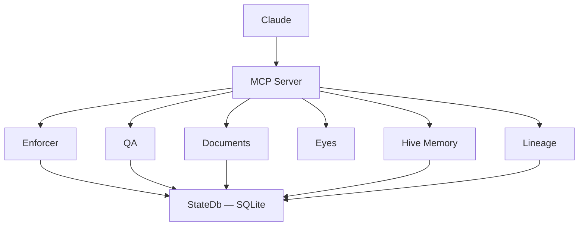

# OpenCheir

Lightweight, open-source document governance MCP server written in Rust.

OpenCheir (from Greek χείρ, "hand") provides document QA, workflow enforcement, audit trails, and multi-agent orchestration as a single MCP binary.



## Features

| Module | Tools | Purpose |
|--------|-------|---------|
| Document QA | 5 | Font, dash, word count, signature checks |
| Document Parsing | 2 | DOCX structure extraction |
| Search | 1 | FTS5 full-text search |
| Enforcer | 4 | Workflow rule engine with hot-reload |
| Lineage | 3 | Audit trail & event tracking |
| Patterns | 2 | Cross-session pattern discovery |
| Memory | 3 | Persistent learning storage |
| Hive | 2 | Domain locking for multi-agent |
| Status | 2 | Health monitoring |

> For ontology engineering (RDF/OWL/SPARQL), see [Open Ontologies](https://github.com/fabio-rovai/open-ontologies).

## Requirements

- Rust 1.80+
- macOS or Linux

## Install

```bash
git clone https://github.com/fabio-rovai/opencheir.git
cd opencheir
cargo build --release
./target/release/opencheir init
```

## Configure Claude Code

Add to `~/.claude/settings.json`:

```json
{
  "mcpServers": {
    "opencheir": {
      "command": "/path/to/opencheir",
      "args": ["serve"]
    }
  }
}
```

For ontology engineering, also add [Open Ontologies](https://github.com/fabio-rovai/open-ontologies):

```json
{
  "mcpServers": {
    "opencheir": {
      "command": "/path/to/opencheir",
      "args": ["serve"]
    },
    "open-ontologies": {
      "command": "/path/to/open-ontologies",
      "args": ["serve"]
    }
  }
}
```

## Tools

Tools appear as `mcp__opencheir__<tool_name>` in Claude Code.

### Document QA

- `qa_check_fonts` — detect font inconsistencies in DOCX
- `qa_check_dashes` — detect dash/hyphen inconsistencies
- `qa_check_word_counts` — check word limits vs actual
- `qa_check_signatures` — detect unfilled signature placeholders
- `qa_full_check` — run all QA checks at once

### Document Parsing

- `parse_document` — extract text, tables, structure from DOCX
- `read_content` — read specific table cell content

### Search

- `search_documents` — full-text search across indexed documents

### Enforcer

- `enforcer_check` — check if tool call is allowed by rules
- `enforcer_log` — view enforcement log
- `enforcer_rules` — list all rules
- `enforcer_toggle_rule` — enable/disable rules

### Lineage

- `lineage_record` — record events
- `lineage_events` — query events
- `lineage_timeline` — session timeline

### Memory

- `hive_memory_store` — store learnings
- `hive_memory_recall` — search memory
- `hive_memory_by_domain` — get learnings by domain

### Patterns

- `pattern_analyze` — discover workflow patterns
- `pattern_list` — list discovered patterns

### Status

- `opencheir_status` — system health summary
- `opencheir_health` — detailed health info

## Enforcer hot-reload

Enforcement rules are loaded from the `rules` table in the SQLite database on startup. Built-in rules are seeded automatically; custom rules can be added in `config.toml`:

```toml
[[enforcer.rules]]
name = "my_rule"
description = "Warn if writing without a prior read in last 5 calls"
action = "warn"
enabled = true

[enforcer.rules.condition]
type = "MissingInWindow"
trigger = "write_document"
required = "read_document"
window = 5
```

While the server is running, edit and save `config.toml`. OpenCheir detects the change and reloads rules within milliseconds — no restart needed. The sliding window of recent tool calls is preserved across reloads.

Toggles via `enforcer_toggle_rule` are written to the DB and survive hot-reloads.

## Domain locking

When two agents write to the same hive memory domain concurrently, last write wins by default. Domain locking prevents this.

**Pattern:**

```
1. hive_claim_domain  →  returns { token, expires_at }
2. hive_memory_store (with token)  →  write succeeds
3. hive_release_domain  →  lock released
```

If another agent tries to write to a locked domain without the matching token, it receives:

```json
{"error": "domain 'ops' is locked by 'agent-1' until 2026-03-09T12:01:00"}
```

Locks expire automatically (default TTL: 60 seconds, configurable per-claim via `ttl_seconds` and globally via `[hive] lock_ttl_seconds` in `config.toml`). Locking is opt-in — unlocked domains work exactly as before.

## Architecture

```
opencheir/
├── src/
│   ├── gateway/       # MCP tool definitions & routing
│   ├── domain/        # Document QA, image capture
│   ├── orchestration/ # Enforcer, lineage, hive, patterns
│   └── store/         # SQLite state, document parsing, search
└── tests/
```

## License

MIT
